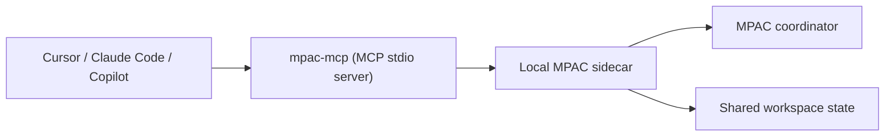

# MPAC 产品路线决策 Deck

副标题：AI 协作编程 x MCP Server x MPAC 协议内核  
用途：产品路线汇报 / 导师汇报 / 合作者讨论  
建议页数：12-14 页

---

## 1. 标题页

**标题**

MPAC 下一步怎么走：  
**先做 AI 协作编程切口，以 MCP Server 形态进入现有 Agent 生态**

**副标题**

- 我们不是在“产品”和“协议”之间二选一
- 我们是在把 MPAC 从协议内核推进成一个真实可接入的产品入口

**讲述重点**

- 这次汇报不是重新发散，而是把我们已经做出的决定讲清楚
- 结论已经明确：  
  **产品切口 = AI 协作编程**  
  **接入形态 = MCP Server**  
  **技术内核 = MPAC**

---

## 2. 一页结论

**核心结论**

- 我们不应该在下面两件事里二选一：
  - 做一个垂直杀手级应用
  - 把 MPAC 暴露成 MCP Server
- 正确路线是把两者合并成同一个决策

**最终决策**

- **切口**：AI 结对 / 组队编程
- **形态**：MCP Server
- **内核**：MPAC

**一句话版本**

> 让不同人的 coding agent 在同一个 repo 里先协调、再动手。

**我们现在实际在做的产品定义**

- `mpac`：协议与协调 runtime
- `mpac-mcp`：MCP 接入层
- 第一阶段产品：让 Cursor / Claude Code / Copilot 里的 agent 在同一 repo 里不撞车地协作

**讲述重点**

- 这不是“两条路线并行”，而是同一条路线的三层
- 用户买单的是“别撞车、可协作”
- 技术上落地的最快入口是 MCP

---

## 3. 问题到底是什么

**今天真实存在的问题**

- 两个开发者各自带着自己的 coding agent，在同一个 repo 上并行工作
- 每个 agent 都只看见自己的用户和自己的上下文
- 它们并不知道别的 agent 正在改什么、准备改什么、已经改了什么

**直接后果**

- 重复修改同一文件
- 意图冲突只能在 commit 之后暴露
- stale commit / rebase / 重做带来额外协调成本
- 冲突需要靠人类手工兜底

**本质判断**

- MCP 解决的是“工具怎么被调用”
- 传统 IDE 协作解决的是“人和人怎么协作”
- 但今天缺的是：
  **agent 和 agent 之间的 coordination layer**

**讲述重点**

- 我们不是在发明另一个编辑器
- 我们是在补上“多个 AI agent 看不见彼此”的这层空白

---

## 4. 为什么第一刀是 AI 结对 / 组队编程

**这张图给出的判断**

- 最直接的场景，就是两个开发者各自带着自己的 coding agent，在同一 repo 中并行工作
- 核心痛点不是“谁写代码更快”，而是“多个 agent 互相看不见”
- 一旦 agent 能 announce intent、发现 scope overlap、冲突前协调，价值立刻可见

**为什么这个切口适合我们**

- 它和我们现有技术资产是最强对齐的
- 我们已经在代码协作上验证了：
  - `file_set` scope overlap
  - stale commit / rebase
  - mutual yield
  - escalation / arbiter resolution
  - claim / takeover

**结论**

- 第一刀不做“通用多 agent 平台”
- 第一刀就做：
  **AI 协作编程**

**讲述重点**

- 这个切口不是拍脑袋选的
- 是顺着我们已经跑通的能力走

---

## 5. 为什么产品形态应该是 MCP Server

**这张图给出的判断**

- 叙事更顺：MPAC 不是 replace MCP，而是 complement MCP
- 分发成本低：用户已经接受“安装一个 MCP server”
- 网络效应强：不同客户端都能通过统一接口接入同一个 coordination layer
- 和我们现有资产直接衔接：
  - `pip install mpac` 已经存在
  - 再做一个 `mpac-mcp` 即可作为产品入口

**为什么这比先做独立 App / IDE 插件更优**

- 不需要先教育市场安装一个新客户端
- 不需要先做重 UI、重插件维护、重分发
- 可以直接进入 Cursor / Claude Code / Copilot 的现有心智

**一句话**

> 不是“带 MPAC 的 MCP”，而是“把 MPAC 暴露成 MCP”。

**讲述重点**

- MCP 不是终点，它是入口
- 真正的 moat 不是插件外壳，而是底层 coordination semantics

---

## 6. 为什么这个决定和我们现有东西高度匹配

**我们已经有的，不是 PPT 概念，而是运行资产**

- `mpac` 已经发布到 PyPI
- GitHub 已经公开
- 协议内核已经完整
- coordinator / server / agent 已经成熟
- 长连接 E2E 场景已经跑过
- ultimate governance / claim / resolution 场景已经跑过

**我们缺的不是能力本体**

我们真正缺的是：

- 一个让现有 AI 客户端能直接接入的标准化入口
- 一个用户不用理解协议细节也能使用的产品接口

**所以**

- 现有 `mpac` 不重写
- 新增 `mpac-mcp` 作为桥接层
- 这是增量扩展，不是推倒重来

**讲述重点**

- 现在做 `mpac-mcp`，是在把协议能力产品化
- 不是从研究原型退回去重搭基础设施

---

## 7. 我们已经把什么做出来了

**当前实现状态**

我们已经新增了 `mpac-mcp` 这一层，并且不只是文档，已经有可运行闭环：

- sidecar 自动发现 / 自动拉起
- repo context 自动解析
- MCP 高层工具已经成型：
  - `who_is_working`
  - `begin_task`
  - `check_overlap`
  - `get_file_state`
  - `submit_change`
  - `yield_task`
  - `ack_conflict`
  - `escalate_conflict`
  - `resolve_conflict`
  - `take_over_task`

**关键设计**

- `mpac-mcp` 本身不维护全局状态
- 状态权威放在本地 MPAC sidecar
- 也就是：
  **MCP stdio 进程是壳，sidecar 才是 session authority**

**讲述重点**

- 这意味着我们不只是“想好了路线”
- 我们已经开始把这条路实做出来

---

## 8. 当前架构图

**这一层分工非常清楚**

- 宿主客户端负责调用 tools
- `mpac-mcp` 负责把 tool 调用翻译成高层协调动作
- MPAC sidecar 负责 session 状态、intent、conflict、claim、resolution

**为什么这样设计**

- MCP `stdio` 进程彼此不共享内存
- 所以必须有单独的状态权威
- 复用现有 `MPACServer` sidecar，是最省改动、最稳定的做法

**讲述重点**

- 这不是临时拼装
- 而是“现有协议 runtime + 现有 MCP 生态”之间的干净桥接

---

## 9. 证据：我们已经验证到什么程度

**目前已经通过的验证**

- `pytest`：`14/14 passed`
- `milestone0`：双进程共享同一个 local coordinator 成功
- `smoke_tools`：`begin_task + check_overlap` 成功
- `smoke_commit`：`begin_task + submit_change + yield_task` 成功
- `smoke_governance`：`ack + escalate + resolve` 成功
- `smoke_takeover`：`suspend + claim + replacement intent active` 成功

**这意味着**

- 基础协作链路已经通
- 提交链路已经通
- 治理链路已经通
- 故障恢复 / 接管链路已经通

**一个很关键的工程细节**

- 我们的 smoke 现在都跑在 **isolated scratch workspace**
- 每次测试启动 **ephemeral sidecar**
- 跑完自动清理

**价值**

- 不会被旧 session 污染
- 更适合 demo
- 更适合后续稳定回归

**讲述重点**

- 这说明我们不是停留在“概念可行”
- 而是已经有初步产品级验证意识

---

## 10. 我们的决定到底是什么

**最终产品路线**

### v0：现在

- 场景：AI 协作编程
- 交付：`mpac-mcp`
- 模式：本地 `stdio` MCP server + 本地 sidecar
- 目标：单机 / 同 repo / 双 agent 强 demo

### v1：下一步

- shared coordinator
- 多人跨机器协作
- 更真实的团队 session

### v2：再下一步

- hosted coordinator
- dashboard / team management
- 真正的平台化产品

**一句话**

- **现在先做入口**
- **以后再做平台**

**讲述重点**

- 这条路兼顾了研究叙事、产品落地、工程现实
- 没有一上来跳进重产品泥潭

---

## 11. 为什么现在不先做别的

**不建议先做的方向**

- 不先做通用多场景平台
- 不先做重型 VS Code 扩展
- 不先做独立 app
- 不先做 hosted SaaS
- 不先暴露 21 个协议消息给终端用户

**原因**

- 会把我们拉进 UI、分发、兼容性、运维这些次级问题
- 会稀释“agent coordination layer”这个真正差异化价值

**最重要的判断**

- 我们真正的壁垒不是“一个插件面板”
- 而是“让不同人的 agent 可以在 shared work 上彼此看见、彼此协调”

**讲述重点**

- 先抓最短、最硬、最能证明价值的路径
- 才能把产品和论文叙事同时立住

---

## 12. 对外怎么讲这件事

**不建议的讲法**

- “我们做了一个 21-message 多主体协议”
- “我们有 Lamport watermark 和三层 state machine”

**建议的讲法**

- Stop your coding agents from stepping on each other.
- MPAC is the coordination layer for multiple AI agents working on the same repo.
- `mpac-mcp` lets existing coding agents coordinate before they commit.

**中文一句话**

> 让你的 coding agent 在多人协作时先打招呼、再动手。

**三层表达**

- 产品切口：AI 协作编程
- 产品入口：MCP Server
- 技术内核：MPAC

**讲述重点**

- 用户先理解痛点，再理解产品，再理解协议
- 不是反过来

---

## 13. 接下来 4-8 周应该怎么推进

**优先顺序**

### 1. 真实 MCP host 集成

- 真接 Claude Code
- 真接 Cursor / 其他 MCP host
- 验证工具发现、调用、返回值体验

### 2. 打磨 product interface

- 参数名是否自然
- 返回值是否足够 agent-friendly
- 错误语义是否稳定

### 3. shared coordinator

- 让不同机器、不同开发者真的能进同一个 session

### 4. demo / onboarding

- 做一个可录屏、可复现、可讲给外部看的强 demo

**讲述重点**

- 不是继续无限扩充协议
- 而是开始补“真实用户怎么接入、怎么用、怎么理解”

---

## 14. 收尾页

**最终 takeaway**

- MPAC 的问题定义是对的
- 第一产品切口已经清楚：AI 协作编程
- 第一交付形态已经清楚：MCP Server
- 而且我们已经不只是决定了方向，而是已经开始把它实现出来

**最简总结**

> 我们不是在做一个抽象协议项目。  
> 我们是在把 MPAC 做成现有 coding agents 可直接接入的协作层。

**结束句**

下一步不是继续讨论“做什么”，而是继续把 `mpac-mcp` 接进真实客户端，证明它能成为 AI 协作编程的标准入口。
