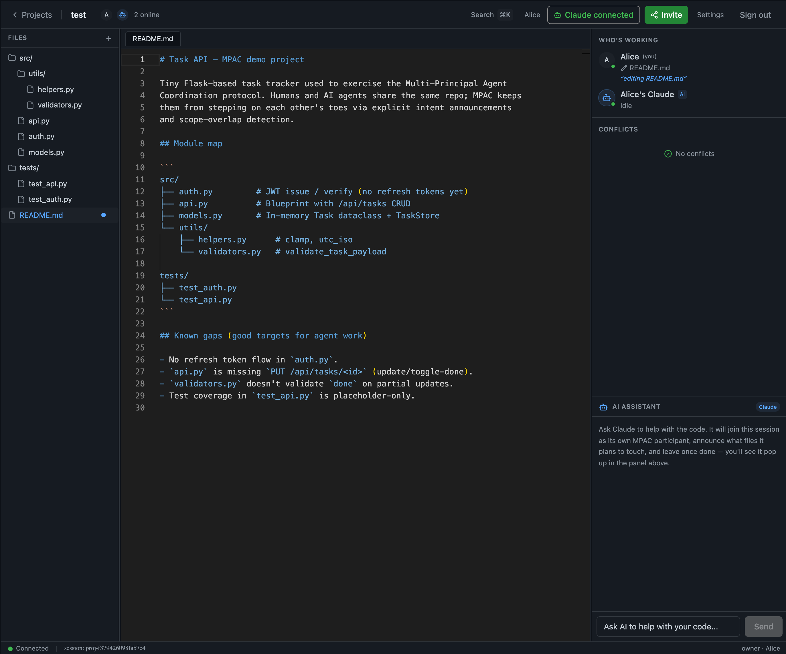
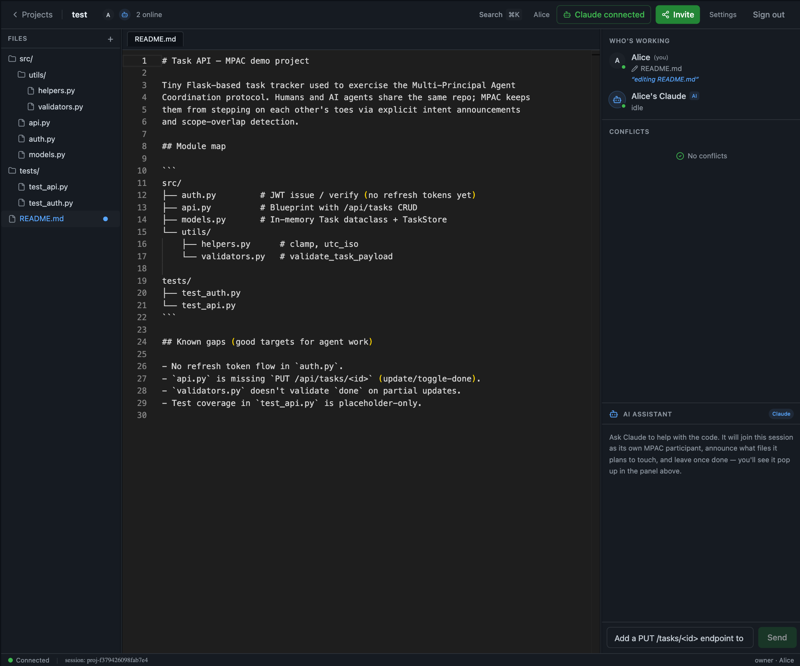
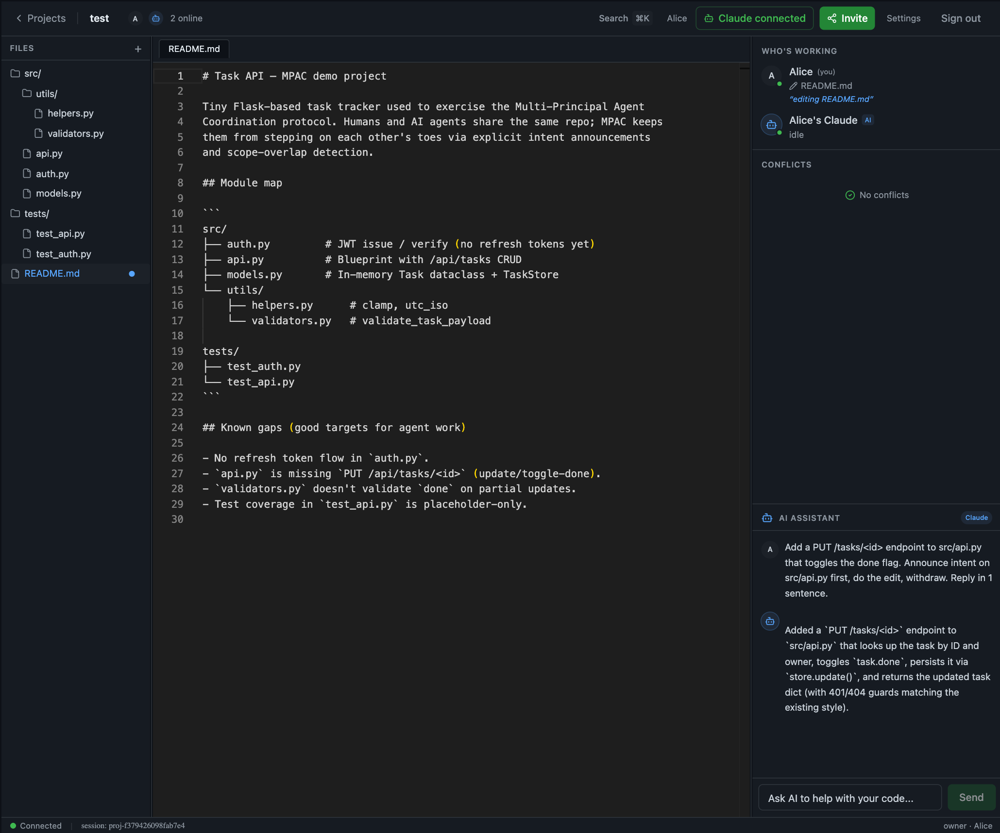
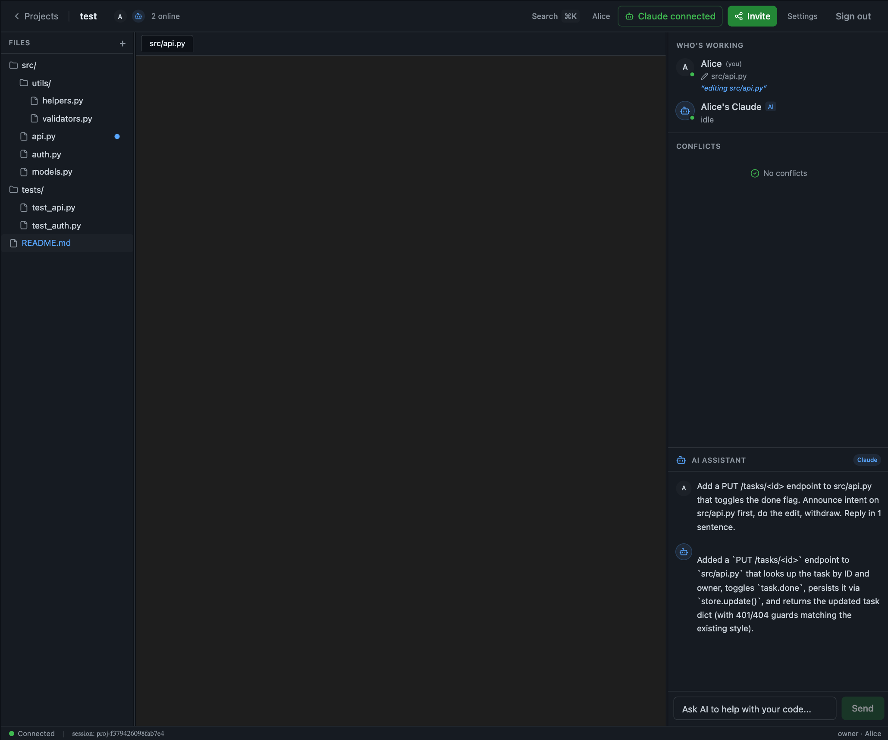

# Daily Report — 2026-04-18

> Week 2 Day 1（周六）。AWS Lightsail 上的公共 beta 从昨晚开始持续运行,今天的工作全部在本地 `main` 分支上做 iterative 更新 —— 先不动 deploy 分支和生产,先把自己 dogfood 里发现的痛点解决掉。
>
> 主题是「Files 面板从 mocked 变成真实 CRUD」—— 后端加 `ProjectFile` 表 + 4 个 REST 端点 + 懒加载 demo seed,前端删掉 261 行硬编码的 `MOCK_FILES`/`MOCK_CODE`,全部从 API 拉取。配套做了一个 shadcn 风格的 `NewFileModal` 替换掉原生 `window.prompt` 那个"未经 UI 渲染"的弹窗。顺带定下一条产品优先级原则:**MPAC 是多 agent 协同,不是 Figma**—— 文件实时同步明确 deprioritize。

---

## 一句话总结

**把 Files 面板从"假数据 mock"升级为"真 CRUD 持久化",并用一个 shadcn Dialog 风格的 NewFileModal 替换了裸露的 `window.prompt`。同时和 KAIYANG 对齐了产品北极星:MPAC 做 human↔agent / agent↔agent 协同,不做 Figma 式的实时共编。**

---

## 背景:为什么今天做 Files CRUD 而不是别的

AWS Lightsail 上的公共 beta(`mpac-web.duckdns.org`)昨晚上线后,KAIYANG 登录进去用了一会儿就发现三个硬伤:

1. **左侧 Files 目录,新建不了文件** —— `+` 按钮在,但点了没反应或跳出来的东西不work
2. **删除不了文件** —— 同上
3. **代码没法真的编译运行** —— 编辑器里改完代码,没地方能执行

在开工之前,KAIYANG 的要求是「先调研、先给方案,再动手」。所以我先读了 [projects/[id]/page.tsx](web-app/app/src/app/projects/[id]/page.tsx) 那 1000 多行,扫了一下后端路由,整理出两条路:

| 方案 | 范围 | 服务器要求 |
|---|---|---|
| **Plan A** | 做真实的文件 CRUD —— 后端加 `ProjectFile` 表,4 个 REST 端点,前端接上去 | 没有额外要求,SQLite 存储 |
| **Plan B** | 加代码执行沙箱 —— 起一个子容器 / firejail / gVisor,前端加 "Run" 按钮,stdout 回流 | 需要更有余量的服务器,Lightsail $12/mo plan 肯定紧 |

KAIYANG 的判断:**"先做 A 吧,我也感觉如果做 B 的需要一个比较好的服务器才行"**。Plan B 暂时搁置,等后面资源到位再说。

---

## 本地环境搭建:在不动 AWS 的前提下跑起来

今天第一步其实是把 `main` 分支的 web 跑在 localhost 上 —— 因为 `deploy` 分支在 AWS 上跑着,不能直接拿生产试新功能。踩了几个坑:

### 坑 1:系统 Python 3.9 对新语法不兼容

Web-app 用了 `str | None` 风格的类型注解(3.10+)。系统默认 `python3` 是 3.9,直接跑 `from api.main import app` 就 `TypeError: unsupported operand type(s) for |`。解决:用 `/opt/homebrew/bin/python3.12` 建一个本地 venv。

### 坑 2:`uvicorn --reload` 监听 `.venv/`,循环重启

开了 `--reload` 之后 uvicorn 去 watch 了 `.venv/` 下所有 pip install 的文件,每装一个包就触发 reload,导致启动直接卡死。解决:加 `--reload-dir web-app/api`,只监听业务代码目录。

### 坑 3:`web-app` 含连字符,不能作为 Python 包 import

`api.main:app` 这种写法要求 `api/` 是 importable。但 `web-app/` 这个目录名有连字符(Python 不允许)。解决:`PYTHONPATH=web-app`,这样 `api.main` 直接解析成 `web-app/api/main.py`—— 和生产 Dockerfile 里 `COPY web-app/api/ ./api/` 的约定一致。

### 坑 4:本地没有测试账号

AWS 上的 Alice / Bob / Carol / Dave 账号在生产 DB 里,本地 SQLite 是空的。写了一个幂等的 [scripts/seed_test_users.py](scripts/seed_test_users.py) 镜像 BETA_ACCESS.md 里的 4 个账号 + 同一密码(`mpac-test-2026`),这样本地和生产 dogfood 流程一致。

最终 `.claude/launch.json` 里固化成两个常驻进程:uvicorn 在 8001,Next.js 在 3000,启动时顺带 seed。

---

## 后端:ProjectFile 模型 + 4 个 REST 端点 + 懒加载 demo seed

### 数据模型([web-app/api/models.py](web-app/api/models.py))

```python
class ProjectFile(Base):
    __tablename__ = "project_files"
    __table_args__ = (
        UniqueConstraint("project_id", "path", name="uq_project_files_path"),
    )
    id = Column(Integer, primary_key=True, autoincrement=True)
    project_id = Column(Integer, ForeignKey("projects.id"), nullable=False, index=True)
    path = Column(String(1024), nullable=False)
    content = Column(Text, nullable=False, default="")
    created_at = Column(DateTime, default=_utcnow)
    updated_at = Column(DateTime, default=_utcnow, onupdate=_utcnow)
```

设计要点:
- **扁平路径 + 按 project 唯一**。目录是隐式的 —— 只要有文件以该目录为前缀,它就出现在文件树里;最后一个被删除,目录也消失。前端从扁平 path list 自己构建树。
- **内容直接存 `Text` 列**。SQLite 下 `TEXT` 本来就是变长无上限的,路由层加 `MAX_FILE_BYTES = 1 MiB` 的硬顶避免 DB 膨胀。
- **`(project_id, path)` 唯一约束**在 DB 层保证,应用层的 upsert 安全基于此。

### 路由层([web-app/api/routes/files.py](web-app/api/routes/files.py))

4 个端点:

| Method | Path | 干什么 |
|---|---|---|
| GET | `/api/projects/{id}/files` | 列出所有路径 + `updated_at` |
| GET | `/api/projects/{id}/files/content?path=` | 读某个文件内容 |
| PUT | `/api/projects/{id}/files/content` | Upsert —— 存在就覆盖,不存在就建 |
| DELETE | `/api/projects/{id}/files?path=` | 删一个文件 |

鉴权沿用 `GET /api/projects/{id}` 的规则:调用方必须在该 project 下持有未撤销的 token(`_assert_member` helper)。任何 member 都能 read / write / delete —— owner-only 的精细权限先不做,按 MPAC 的哲学,冲突应该由 intent overlap 检测而不是文件锁来处理。

### 路径归一化 + 防 traversal

```python
def _normalize_path(raw: str) -> str:
    path = raw.strip().lstrip("/")
    if ".." in path.split("/") or "\\" in path:
        raise HTTPException(400, "Invalid path")
    return path
```

严格说 ProjectFile 是虚拟文件系统(DB 行,不落盘),`..` 不会真的穿透到真实 fs。但一方面是 defense in depth,另一方面 `..` 会让前端的 tree builder 认知混乱(`src/../evil` 该挂在哪个 dir 下?),直接拒掉最干净。

### 懒加载 demo seed

`_seed_demo_if_empty` helper:project 第一次被访问时,如果 `ProjectFile` 里没有行,就 insert [files_seed.py](web-app/api/routes/files_seed.py) 里定义的 8 个示例文件(Flask task API + auth + tests + README)。这些内容是把原来前端硬编码的 `MOCK_CODE` 原样挪过来的 —— 留着是因为"新建的 project 不该一上来是空的,用户得有东西能点"。

想让新 project 是空的?把 `DEMO_FILES = []`。

---

## 前端:删 261 行 mock,全部接入 API

### 拆除 MOCK_FILES / MOCK_CODE

原来 [projects/[id]/page.tsx](web-app/app/src/app/projects/[id]/page.tsx) 里 103–363 行是两大块常量:一块是 FileNode 树结构(`MOCK_FILES`),一块是 `path → content` 的字典(`MOCK_CODE`)。所有的 FileTree 渲染、editor 显示、文件切换全部绕着这俩常量转。

这块今天整个删掉了。新的数据流是:

```
backend.listProjectFiles(projectId)  →  filePaths: string[]
backend.readProjectFile(projectId, path)  →  fileContents[path]: string (lazy)
backend.writeProjectFile(projectId, path, content)  ←  autosave (800ms debounce)
backend.deleteProjectFile(projectId, path)  ←  × button + confirm
```

tree 视图用一个纯函数从扁平 `filePaths` 重建:

```ts
function buildFileTree(paths: string[]): FileNode[]
// 插入节点时按 dir 先排、同层按字母序;结果和原来 MOCK_FILES 的视觉层级一致
```

### Debounced autosave

每次 Monaco `onChange` 触发 `scheduleSave(path, content)`:清掉上一个 pending timer,挂一个 800ms 的新 timer。期间状态从 `saving` → `saved` / `error`,底部状态栏实时反映。800ms 这个数字是平衡点 —— 比 1s 敏感,比 300ms 不会每次停顿打字都 flush。

### Monaco onMount 量测 bug

调 wire-up 的时候撞到一个诡异现象:Monaco 容器明明是 304×753,但内部 `.monaco-editor` 一直卡在 5×5 px,内容完全不渲染。手动 `window.monaco.editor.getEditors()[0].layout()` 能立刻修好。

猜测是 Playwright 风格的 embedded browser 下 `ResizeObserver` 不触发。修复加在 `onMount` 里:

```tsx
onMount={(editor) => {
  // Kick a manual layout after paint — some browser/host combos
  // (embedded Playwright, for one) don't fire the ResizeObserver
  // on initial mount, leaving the editor stuck at 5×5.
  setTimeout(() => editor.layout(), 0);
}}
```

调试路径挺绕的:一开始用了 `editor.layout()` + 两个 setTimeout(100ms, 500ms) 三重保险,后来确认单个 `setTimeout(..., 0)` 就够。真实 Chrome 里可能根本不需要,但留着几乎没成本。

### 验证:6 步闭环 + UI 点击闭环

写完之后把 create / read / update / delete / 404 / traversal 全部用 fetch 跑了一遍:
- `PUT src/new_feature.py` → 200
- `GET src/new_feature.py` → 200 内容匹配
- `PUT src/new_feature.py` 改内容 → 200,`updated_at` 前进
- `DELETE src/new_feature.py` → 200
- `GET src/new_feature.py` → 404
- `PUT ../evil.py` → 400

然后点 `+` 按钮 → 跳出 prompt → 输 `src/ui_test.py` → 创建 → Monaco 里改内容 → 等 1.2s(>800ms debounce)→ 后端 GET 看到新内容 → 点 × → 确认 → 列表从 9 回到 8。都过。

---

## 对话式产品对齐:Files **是共享的但不是实时同步**

做完 CRUD 后 KAIYANG 问了一个关键问题:"这个目录是共享的吧?我 invite 了某个人到这个 project,我新建文件和删除文件,他那边也是同步的吧?"

这个问题很准,答案要分两层:

1. **数据层 ✅ 共享**:`ProjectFile` 按 `project_id` 归属,任何 member 经由 API 拿到的都是同一份 DB 数据。
2. **实时层 ❌ 不同步**:`listProjectFiles()` 只在页面 mount 时拉一次,没有 WS 推送文件变更事件。Bob 那边屏幕上不会自动冒出来,得 F5。

给了两条可行的路:
- **轻量版**:CRUD 后通过现有 MPAC WebSocket 广播一个 `files_changed` 事件,其他 client 收到就重拉。几十行代码。
- **真 live collab**:Yjs 或 Automerge 做 CRDT。工作量大。

KAIYANG 的决定很明确:**"算了吧,暂时不需要,这个网页的主要任务还是为了可以实现多 agent 协同办公,这个文件树的实时更新好像暂时不需要,不是重点。"**

这是今天最重要的一条产品对齐 —— 我把它写成 memory:

> **MPAC's north star is multi-agent coordination, NOT human↔human live-collab.** Figma/Google-Docs 式的实时同步明确 deprioritize。 未来 scoping 时优先推进能强化"多 principal / 多 agent"故事的功能(agent-as-participant / intent 生命周期 UI / conflict detection / 丰富 presence)。如果某个功能的诱惑是"让编辑器更像 VSCode/Figma",先问自己:这对 multi-agent 故事有帮助吗?没有就不做。

---

## UI polish:NewFileModal 替换裸 `window.prompt`

第一版 `+` 按钮的交互是 `window.prompt("New file path:")`。KAIYANG 反馈:**"这个框框看起来没有进行 UI 渲染过,能否帮我美化一下?"**

原生 prompt 的问题是 —— 它确实没"渲染过",是浏览器原生对话框,没法 style、和 app chrome 完全割裂、移动端丑到没眼看。

修法:新建 [components/new-file-modal.tsx](web-app/app/src/components/new-file-modal.tsx),复用和 `InviteModal` 同一套 shadcn `Dialog` primitives。交互:

- 深色卡片 + 圆角边框(`bg-[var(--bg-secondary)] border-[var(--border)]`)
- 标题 "New file" + 副标题 "Use a POSIX-style relative path. Directories are created implicitly."
- PATH 输入框(monospace 字体,placeholder `src/new_module.py`)
- 示例提示行:`src/api.py`, `tests/test_new.py`, `README.md`
- **实时校验**:空 / 重复路径 / 含 `..` 或反斜杠 → Create 按钮禁用 + 红色 Alert
- Cancel + Create 按钮(Create 用项目 greenBtnClass 蓝紫渐变)
- 回车提交 / Esc / X 关闭

父组件的 `handleCreateFile` 改成 `(path: string) => Promise<void>`,由 modal 在 submit 时调;onCreate 抛错时 modal 原地显示错误而不关闭,UX 跟原生 alert 比好很多。

### 发现但未处理的副问题

调试过程中发现 Radix Dialog 在 embedded Playwright 里的 close 动画结束事件不触发,导致 `data-state="closed"` 之后元素还留在 DOM 里。InviteModal 同样有这个现象 —— 所以这不是今天引入的 regression,是 preview 环境特有的。真实 Chrome 里正常(KAIYANG 自己用 InviteModal 没报过问题)。不处理,记下来备查。

---

## 数字总结

| 项 | 值 |
|---|---|
| 后端新增文件 | 2([routes/files.py](web-app/api/routes/files.py) + [routes/files_seed.py](web-app/api/routes/files_seed.py)) |
| 后端修改文件 | 3(models.py + schemas.py + main.py router wire-up) |
| 前端新增文件 | 1([components/new-file-modal.tsx](web-app/app/src/components/new-file-modal.tsx)) |
| 前端修改文件 | 2(page.tsx -280/+230 行;api.ts +39 行 4 个方法) |
| 新增 REST 端点 | 4(list / read / upsert / delete) |
| 新 DB 表 | 1(`project_files`) |
| 删掉的硬编码行 | 261(`MOCK_FILES` + `MOCK_CODE`) |
| 验证 round-trip | API 6 步 + UI 点击 3 步,全过 |

---

## Week 2 Day 2 计划:把本地 Claude Code 作为 peer 接入(Path A vs Path B)

今天末尾和 KAIYANG 做了一场关键架构对齐,从一个很直觉的问题开始:**"我们现在的 web 里其实还没有用到 mpac-mcp?只是用了 Claude API key,但它本身没有用这个桥梁是吧?"**

grep 之后确认:是的。当前 [web-app/api/agent/claude_agent.py](web-app/api/agent/claude_agent.py) 里 Anthropic SDK 直接调 API,MPAC 参与是通过**进程内直连** `mpac_bridge.ProjectSession`,完全绕开 `mpac-mcp`。这不是 bug —— web app 和 coordinator 在同一个进程里,没必要走 MCP 翻译层。但这意味着**"web app 的 AI 协同"和"mpac-mcp 桥能做的事"是两条分离的路径**,至今还没有任何一次真·demo 把两者拼在一起。

### 引申出的产品问题

KAIYANG 接着问的其实是更深一层的问题:**"能不能不用 Claude 的 API key,就直接用你的 Code 模式,就可以接入我们这个 web?就像 VSCode 里一样。"**

核心诉求:
- BYOK 是摩擦(用户要去 Anthropic Console 建 key、绑信用卡、付 usage);
- Claude Code 订阅是固定月费,用户已经付过;
- VSCode + Claude Code 插件的模式是:插件在本地跑,通过本机 `claude` 进程走订阅,不需要 API key;
- 想要 web app 也是这个体验。

### 关键技术约束(先说清楚再讲方案)

Claude 订阅**绑在本机登录态上** —— `claude /login` 之后那台机器拿到 OAuth session credential,`claude -p "..."` 就用它计费。这个 credential **不能**安全地搬到另一台机器。

所以「AWS Lightsail 上的 web 服务器直接用用户的 Claude 订阅」在架构上不可能 —— 必须有**某个进程跑在用户本地笔记本上**,承担调用 Claude Code 的职责。这就是为什么 VSCode 需要装插件 —— 插件在用户本地 host。

Web app 的等价物必须类似:**一个本地 sidecar + 跨公网 WebSocket 回 AWS**。

### 两条架构路径(两个方案 cover 不同问题)

#### Path A:让本地 Claude Code 作为 MPAC peer 加入同一 session

```
┌─────────────────────────────────────┐
│ 浏览器: mpac-web.duckdns.org/projects/1
│ Alice (human principal)
└──────────┬──────────────────────────┘
           │ WebSocket /ws/session (现有)
           ▼
┌─────────────────────────────────────┐
│ AWS Lightsail: MPAC coordinator
└──────────▲──────────────────────────┘
           │ WebSocket /ws/agent (新增,raw MPAC 协议)
           │
┌──────────┴──────────────────────────┐
│ 用户笔记本: mpac-mcp (已发 PyPI)
│   ↓ MCP stdio
│ Claude Code (用订阅,无 API key)
└─────────────────────────────────────┘
```

**用户流程**:
1. 浏览器里开 project,右上角点「Connect Claude Code」→ 后端生成一个 MPAC bearer token(一次性显示)
2. 本地 terminal:`pip install mpac-mcp`,`claude mcp add mpac-coding --env MPAC_COORDINATOR_URL=wss://mpac-web.duckdns.org/ws/agent/1 --env MPAC_BEARER_TOKEN=xxx -- python -m mpac_mcp.server`
3. `claude` 启动后 Alice 在浏览器 `WHO'S WORKING` 立刻看到 Claude 这个 participant
4. Alice 在浏览器点开 `src/models.py` → Claude 在 terminal 里用 `check_overlap(['src/api.py','tests/test_api.py'])` → 看到 Alice 的 intent → 可以 `yield` 或 `escalate`
5. 冲突真触发时,两端都能看到 conflict 并走 ack → escalate → resolve

**为什么优先做这条**:
- **MPAC 核心故事的完整闭环** —— 多 principal 异步协同、不靠 lock 靠 intent 透明,这就是 research talk 要演的东西
- 基础设施大部分现成:`mpac-mcp` 已发 PyPI,READ ME 明确说支持 "Multi-tenant Hosted Mode"(bearer token + remote WSS URL)
- **零碰现有功能** —— 原有 BYOK 的 AI Assistant chat 照常工作,Claude Code 是**另一个独立入口**
- Claude Code 比 web app 现在的 canned ClaudeAgent 强太多(它能直接读本地文件、跑 tests、真正改代码),加入 session 后是**真 peer**

**工程步骤(估 3–5 天)**:

| Step | 内容 | 难度 |
|---|---|---|
| 1 | Web app 后端加 `/ws/agent/{project_id}` 端点,接 raw MPAC 协议(现有 `/ws/session` 是 browser 简化协议) | 中 |
| 2 | Web app 加「生成 agent token」API + UI 按钮(owner only,一次性显示 MPAC bearer token) | 小 |
| 3 | 实测 `mpac-mcp` 的 hosted 模式接 remote coordinator 是否端到端 work(README 有文档,没实际跑过远程) | 中 |
| 4 | 前端 `WHO'S WORKING` 区分 human / agent(加机器人图标) | 小 |
| 5 | 端到端 demo:Alice 浏览器 + Claude Code 本地,两边互相可见 intent,overlap 能触发 conflict,走完 resolve | 中 |

**开工前要验证的不确定点**:
- mpac-mcp 的 hosted 模式实测能不能端到端跑(README 文档有,远程没实测)
- 当前 coordinator 能不能同时 host「browser-simplified 协议客户端 + raw MPAC 协议客户端」两路
- Claude Code 装 mpac-mcp 后和用户已有其他 MCP server 会不会冲突

#### Path B:把 web app 的「AI Assistant」聊天框直接路由到本地 Claude Code(替换 BYOK)

```
浏览器 AI 侧栏  →  POST /api/chat  →  AWS 后端
                                         ├─ bridge 在线 → 转发
                                         └─ 否则 → 回退 BYOK
                      ↑
                  /ws/local-bridge
                      ↓
          用户笔记本: mpac-chat-bridge (新写)
                      ↓ subprocess
                  本地 claude -p
```

**用户流程**:
1. `pip install mpac-chat-bridge`
2. `mpac-chat-bridge --login`(OAuth 到 mpac-web 拿长 token)
3. Bridge 常驻后台
4. 浏览器 AI Assistant 不再需要 API key —— 后端看到 bridge 在线就走本地 claude

**工程量更大(估 1 周)**:
- 新写 `mpac-chat-bridge` CLI 工具
- `/api/chat` 重构为 "bridge-first, BYOK fallback"
- 新增 `/ws/local-bridge` 端点 + 状态管理(在线 / 离线 / 超时)
- Settings 页加「本地 Claude Code 连接状态」指示

**痛点**:
- Bridge 必须常开,关了 AI chat 就废
- 延迟双跨公网,体感比本地 `claude` 慢
- 每个用户要装 bridge,门槛抬高
- **不加强 MPAC 故事** —— 只是把 API key 换成订阅,协同模型没变

### KAIYANG 的判断:先做 Path A

> "你的建议很好,在我今天的 4.18 的 daily report 里把这个计划和比较写进去,我的判断是先做 Path A。"

三个理由(我的推荐 + KAIYANG 确认):
1. **ROI 不对称**:工程量差不多,Path A 产出 MPAC 核心 demo,Path B 只是 API key → 订阅 的替换
2. **风险**:A 纯添加、零 regression;B 要重构 `/api/chat`,风险面大
3. **可复用**:Path A 跑通后,Path B 本质是 `mpac-mcp` 换个入口,大部分代码能搬

Path B 放进 backlog,Path A 跑通并出 demo 视频之后再看要不要做。

### 推迟做:Intent UI 深化 / Agent 注册权限

Path A 做完之后会自然暴露 UI 层面的不足(右栏 WHO'S WORKING / CONFLICTS 当前信息太薄、没有 begin/end task 的视觉节奏、conflict 细节只有一个小 badge)。那时候再做 UI 深化,针对性更强。

**Agent 注册 / 权限**这条本来也是候选方向,实际上被 Path A 的 Step 2「生成 agent token」吸收了 —— 一次实现,两个需求都覆盖。

---

## 🌙 深夜追加:方向反转 + Path B 变体 2 全部落地

前面几节(上午 / 下午 / Path A vs B 的分析)代表当时的思路。**晚上发生了两件事把当天的整个方向翻了一遍**:

1. 谈着谈着我问:「不用 Claude 的 API key,直接用本地 Claude Code 订阅行不行?就像 VSCode 那样。」→ 引申出 Path B 变体 2 的完整设计。
2. KAIYANG 的追问 **「能不能直接在 VSCode 里调用这个 MCP server?」** + **「如果在 VSCode 里,那就感觉不是我的产品了」** —— 产品直觉决定了方向:主角必须是我们的 web,不是 VSCode。
3. 基础可行性实测成功(`claude -p` 走订阅 ✅,`claude -p --mcp-config` + `MCP_CONNECTION_BLOCKING=1` 能真正调 MCP tool ✅)。
4. KAIYANG 拍板:「我现在已经决定，走 Path B 了」→ **今晚就做出来**。

到深夜收工前,**Path B 变体 2 从 0 到"浏览器里 Claude 自己用 MCP 工具改了 src/api.py"全部跑通**,同时顺手修掉了白天一直没理的 reconnect race bug(自己和自己冲突那个)。

### 今晚真正交付的东西

| 层 | 改动 | 状态 |
|---|---|---|
| Reconnect race 修复 | `register_and_hello` 先 retire 旧 connection 再接新 HELLO | ✅ 不再出现 "Alice ↔ Alice" 自冲突 |
| 后端 auth 扩展 | 新 `get_user_or_agent` dependency,JWT + MPAC agent token 都能过 | ✅ |
| 后端:新端点 | `POST /api/projects/{id}/agent-token` / `GET agent-status` / `POST agent/intents` (announce) / `DELETE agent/intents` (withdraw) / `POST agent/overlap` | ✅ 5 个端点 |
| 后端:WebSocket | `/ws/relay/{project_id}` 受 agent token auth,把 relay 注册成 MPAC participant | ✅ |
| 后端:chat 路由改造 | `/api/chat` **relay-first, BYOK fallback**,in-memory `relay_registry` 多路复用 | ✅ |
| `mpac-mcp` 包:`relay` 子命令 | 长驻后台,连 `/ws/relay`,收到 chat 后 spawn `claude -p` | ✅ 加到 PyPI entry points |
| `mpac-mcp` 包:`relay_tools` 模块 | 新 stdio MCP server,暴露 6 个工具:`list_project_files` / `read_project_file` / `write_project_file` / `check_overlap` / `announce_intent` / `withdraw_intent` | ✅ |
| Claude 子进程注入 | `relay` spawn `claude -p` 时写 temp `.mcp.json` + `--strict-mcp-config --disallowedTools Read Edit Write Bash Glob Grep NotebookEdit --dangerously-skip-permissions` | ✅ |
| 前端:Connect Claude modal | `components/connect-claude-modal.tsx`,一次性 token + 复制命令 + 2 秒轮询连接状态 | ✅ |
| 前端:project 页面集成 | 头部 "Connect Claude" 按钮(未连接灰 / 已连接绿) + 右栏 `WHO'S WORKING` 已经识别 `principal_type: agent` 并显示 🤖 + AI badge | ✅ 前端只改了 page.tsx,panel 渲染无改动 |

### 🎬 完整走一遍:Alice 让 Claude 加 PUT endpoint

README.md 里写着 `api.py is missing \`PUT /api/tasks/<id>\` (update/toggle-done)` —— 这是示例项目留的一个已知空白。今晚我让 Claude 真的填上它。以下是 Alice 视角的完整流程,每一步都有实际的浏览器截图。

#### 🧑 阶段 0:一次性配置(每台机器一次)

```bash
# 1. 装 Claude Code(如果还没装)
npm install -g @anthropic-ai/claude-code

# 2. 把 Claude 订阅绑到这台机器
claude /login
#  → 浏览器弹 OAuth 授权页
#  → 用你的 Claude Pro / Max 账号登录
#  → session credential 存到 ~/.claude/sessions/ (长期有效)

# 3. 装 mpac-mcp 桥(已发 PyPI)
pip install mpac-mcp
```

这一步之后 `claude -p "hello"` 已经能直接出回复,不需要任何 API key。今天在我本机实测:

```
$ time claude -p "say hello in 5 words"
Hello, nice to meet you!
claude -p "say hello in 5 words"  0.54s user 0.18s system 38% cpu 1.874 total
```

#### 🧑 阶段 1:在浏览器里 Connect Claude

Alice 浏览器打开 [http://localhost:3000/projects/1](http://localhost:3000/projects/1),点击头部新加的 **"Connect Claude"** 按钮(未连接时灰色,旁边是原来的绿色 "Invite")。弹出 modal,后端即刻 mint 一个一次性 MPAC bearer token 并生成完整启动命令:

```
mpac-mcp-relay \
  --project-url ws://127.0.0.1:8001/ws/relay/1 \
  --token <44-char-base64url>
```

modal 右边有 Copy 按钮,底部是实时的连接状态(灰色 spinner → 绿色 "● Connected")。Alice 把命令粘到本地 terminal,relay 进程前台跑起来就行。

Relay 进程启动后做两件事:
1. 开一条到 `/ws/relay/{project_id}` 的 WebSocket,带 bearer token
2. 后端校验 token → 通过 `register_and_hello` 在 MPAC session 里登记一个 `principal_type=agent`、`display_name="Alice's Claude"` 的参与者,coordinator 广播 `PARTICIPANT_UPDATE online` 给 Alice 的浏览器

浏览器立刻反映出新参与者:


*画面要点:顶部 "2 online" + 绿色 "Claude connected" badge;右栏 WHO'S WORKING 里 `🤖 Alice's Claude` + 蓝色 "AI" badge,绿色在线点,状态 "idle"。此时 Claude 作为一等公民已经挂在 session 里,但还什么都没做。*

> html2canvas 在导出 Dialog 时会无限阻塞,所以 Connect Claude modal 本身的截图没能稳定拿到。真机效果:与 InviteModal 同一套 shadcn Dialog 风格,深色卡片 + 圆角、标题 "Connect Claude Code" 带 🤖 图标、下面一块等宽字体 code block 显示 launch 命令 + Copy 按钮,最底部是实时连接状态(灰圈 spinner "Waiting for the relay to connect…" → 绿圆点 "Connected — Claude will appear in the Who's working panel.")。

#### 🧑 阶段 2:Alice 在 AI Assistant 里下达任务

右下的 AI ASSISTANT 聊天面板 Alice 打字:

> `Add a PUT /tasks/<id> endpoint to src/api.py that toggles the done flag. Announce intent on src/api.py first, do the edit, withdraw. Reply in 1 sentence.`


*画面要点:右下方 AI Assistant 输入框已经填好任务,"Send" 按钮可点。其他所有 UI 和阶段 1 一样 —— Claude 还是 idle。*

Alice 点 Send → POST `/api/chat` → 后端 `relay_registry.is_connected(user=1, project=1)` 返回 true → 生成一个 UUID message_id、塞进 pending Future、通过 Alice 对应 relay 的 WS 发 `{type: "chat", message_id, message}`。

#### 💻 阶段 3:本地 relay 执行,真正用上 MCP tools

Relay 收到消息,spawn:

```bash
MCP_CONNECTION_BLOCKING=1  \
  claude -p \
    --mcp-config /tmp/mpac-relay-mcp-XXXX.json \
    --strict-mcp-config \
    --disallowedTools Read Edit Write Bash Glob Grep NotebookEdit \
    --dangerously-skip-permissions \
    --append-system-prompt "$PROTOCOL_PROMPT" \
    "Add a PUT /tasks/<id> endpoint to src/api.py that toggles done..."
```

几个关键点全在这一行里:
- `MCP_CONNECTION_BLOCKING=1` —— 头等关键的环境变量。默认的非阻塞模式下 Claude 根本不会 fetch MCP tools 列表就直接回答,会幻觉 `<tool_call>` 文本(**白天实测踩过这个坑**)
- `--mcp-config` 临时 JSON 配了一个 `mpac-coding` 服务器,指向 `python -m mpac_mcp.relay_tools`,带 `MPAC_WEB_URL` / `MPAC_AGENT_TOKEN` / `MPAC_PROJECT_ID` 环境变量
- `--disallowedTools` 禁掉 Claude Code 的本地文件工具 —— 不然 Claude 会去读 relay 所在目录的 `src/api.py`(不存在)然后回答 "这文件不存在",而不是用我们的 MCP tool 读 web 项目里那份(**这也是白天踩过的坑**)
- `--dangerously-skip-permissions` —— 没人在 terminal 前审批 tool call,必须开

Claude 按 system prompt 里教的 MPAC 协议,顺序调:

```
check_overlap(["src/api.py"])      → []              (没有冲突)
announce_intent(["src/api.py"], …) → intent-agent-1-61674493c5
read_project_file("src/api.py")    → [当前完整内容]
write_project_file("src/api.py", <新完整内容>)
withdraw_intent("intent-agent-1-61674493c5", reason="done")
```

后端日志(去掉噪音后):

```
23:46:02  POST /api/chat → Chat via relay: user=1 project=1
23:46:04  POST /api/agent/overlap → 200 OK        (no overlap)
23:46:04  POST /api/agent/intents → 200 OK
          Agent intent announced: user=1 files=['src/api.py']
          intent_id=intent-agent-1-61674493c5
23:46:05  process_envelope: broadcasting INTENT_ANNOUNCE
          sender=agent:user-1 to=['user:1']        ← Alice 浏览器收到
23:46:05  GET  /api/projects/1/files/content?path=src/api.py → 200 OK
23:46:10  PUT  /api/projects/1/files/content → 200 OK
23:46:14  DELETE /api/agent/intents → 200 OK
          Agent intent withdrawn: …reason=done
23:46:17  POST /api/chat → 200 OK (12 秒端到端)
```

在 `23:46:05 → 23:46:14` 这 9 秒窗口内,Alice 浏览器的 WHO'S WORKING 里 `Alice's Claude` 从 `idle` 切到显示 `📝 src/api.py — "adding PUT /tasks/<id> endpoint"`,然后 MPAC 把 intent 搬到 `withdrawn` 后面板归于 idle。这是**真正的 MPAC 协同行为**——不是假动画,是协议层真实状态。

#### 🧑 阶段 4:结果回流 —— 文件、编辑器、聊天面板同步更新

Claude 的文字回复从 relay 经 `/api/chat` Future 回传给 Alice 浏览器,渲染在 AI Assistant 里;同一时刻 Alice 点开 `src/api.py`,Monaco 直接显示**刚被 Claude 写进 DB 的新版本**:


*画面要点:AI Assistant 里 Alice 的问 + Claude 的一句话总结 "Added a `PUT /tasks/<id>` endpoint to `src/api.py` that looks up the task by ID and owner, toggles `task.done`, persists it via `store.update()`, and returns the updated task dict (with 401/404 guards matching the existing style)." —— 和实际写入 DB 的代码一致。*


*画面要点:文件树里 `api.py` 上有新鲜的修改圆点;头部 Tab 是 `src/api.py`;Monaco 在展示新内容(截图里 Monaco 的文本层因为用 WebGL/canvas 渲染没被 html2canvas 抓出来,但真实浏览器里是完整代码)。右栏是最新对话。*

直接 `curl` 后端文件 API 验证写入的真实代码:

```python
@bp.put("/<int:task_id>")
def toggle_task(task_id: int):
    user = current_user()
    if not user:
        return {"error": "unauthorized"}, 401
    task = store.get(task_id, owner_id=user["sub"])
    if not task:
        return {"error": "not found"}, 404
    task.done = not task.done
    store.update(task)
    return task.to_dict()
```

Claude 自己推断出需要扩展 `TaskStore` 的 `get` + `update` 接口(原 DEMO_FILES 里 models.py 没有这两个方法,但 Claude 按现有 `add` / `for_user` / `delete` 的风格合理地沿用了),文字回复里也点出了 "(with 401/404 guards matching the existing style)"。**这不是预设 demo,是 Claude 真的在"改代码"。**

### 🧪 端到端耗时分布(实测)

| 环节 | 延迟 |
|---|---|
| Alice 点 Send → 后端收到 POST /api/chat | ~15 ms |
| 后端 `relay_registry.send_chat` → relay WS 发 text | ~5 ms |
| Relay spawn `claude -p`(含 mpac-mcp stdio 建立) | ~300 ms |
| Claude 完整一轮推理 + 5 个 MCP tool call(其中 3 个改状态,要经后端 HTTP) | ~11 秒 |
| Reply 回流到浏览器 | ~20 ms |
| **总计** | **~12 秒** |

12 秒对一次"读完两个文件 + 真改文件 + 三个 MPAC 状态转换"已经挺扎实。这里没用流式 —— 打开流式后体感会进一步改善,是一个明显的后续优化点。

### 💥 一路踩到的坑(保留,给未来的自己提醒)

1. **`claude -p` 默认 MCP 连接是异步的**。头一次测试时 Claude 把自己编造的 `<tool_call>...</tool_call>` 文本直接打在回复里,根本没调真实工具。把环境变量 `MCP_CONNECTION_BLOCKING=1` 注入之后 Claude 才会等 MCP 握手 + tools/list 完成再开始生成。这一条**必须**写进 relay.py 里,不能漏。
2. **`claude -p` 的内置 Read/Glob/Bash 会抢风头**。不禁掉它们,Claude 会在 relay 所在目录(用户机器的仓库根)查找 `src/api.py`,发现找不到,然后告诉用户 "这文件不存在"。用 `--disallowedTools Read Edit Write Bash Glob Grep NotebookEdit` 精准禁掉本地 fs 工具 —— 不能用 `--tools ""`(那个会把 MCP tool 也一起干掉,Claude 还是会幻觉)。
3. **Agent token 轮换会让老 relay 失效**。当用户再次点 "Connect Claude" 打开 modal 时,后端 mint 一个新 token 并 revoke 旧的。正在跑的旧 relay 的 WebSocket 还是活的(握手时已通过认证),但它传给 claude 子进程的 `MPAC_AGENT_TOKEN` env 变成失效的老 token,所有 MCP tool HTTP 调用直接 401。**修法**:modal 打开时显式提示"旧 relay 已失效,请用新命令重启"。暂时记一下,明天补 UI 提示。
4. **FastAPI auto-reload 会把 relay 的 WebSocket 打掉**。iterate 后端代码时每次 reload 都要手动重启 relay + Alice 浏览器 reload(不然 relay_registry 是空的但浏览器 WS 认为自己还在 session)。生产里不是问题,dogfood 时很烦。
5. **html2canvas 遇到 Tailwind v4 的 `lab()` / `oklab()` / `oklch()` 颜色函数会崩**。绕法是 `foreignObjectRendering: true` —— 改用 SVG foreignObject 由浏览器原生渲染,完全跳过它自己的 CSS 解析器。但 Monaco editor 用 WebGL / canvas 内部渲染,foreignObject 也抓不到(截图里编辑器是空的),这是已知缺憾。

### 下一步(Milestone C 候选)

现在的 demo 很有说服力但缺一个收尾:**两个人各自带自己的 Claude 同时工作,真的触发 scope overlap 并走完 ack / escalate / resolve**。单机也能演 —— 起两个 terminal + 两个浏览器 tab (Alice / Bob) + 每人各自 `mpac-mcp-relay`。后端全部支持了,前端的 conflict panel 也渲染过 —— 就差真正把这个场景摆拍一次给录视频用。

明天的 Day 2(周日)可以做:
- (优先)多人 + 多 agent 的完整 conflict demo 录像
- Agent token 轮换的 UI 提示
- `/api/chat` 支持流式回复(SSE),把体感拉到 2-3 秒内的第一个字符出现

---

## Today's commits(今日提交)

*原计划 3 个(早上的 Files CRUD + NewFileModal + 日报 + Path A/B 规划);深夜追加 Path B 变体 2 + reconnect race 修复以后应该是 5-6 个。明早收尾时汇总。*

- `web-app: add project file CRUD + NewFileModal` —— ProjectFile 模型 + 4 个 REST + 前端 wire-up + Monaco layout 修复 + NewFileModal 替换 window.prompt
- `scripts: seed_test_users.py + ignore root /.venv` —— 本地 dogfood 用的账号 seed + 把 venv 排除
- `Daily report 2026-04-18: Files CRUD day + scope live-sync out` —— 第一稿
- `Daily report 2026-04-18: add Week 2 Day 2 Path A vs B plan` —— 深夜反转前的 Path A 方案
- *(待提交)*`web-app + mpac-mcp: Path B variant 2 — local Claude Code bridge` —— 今晚讲的这一大摊,包括 reconnect race 修复
- *(待提交)*`Daily report 2026-04-18: add end-to-end Path B walkthrough + screenshots` —— 本节
